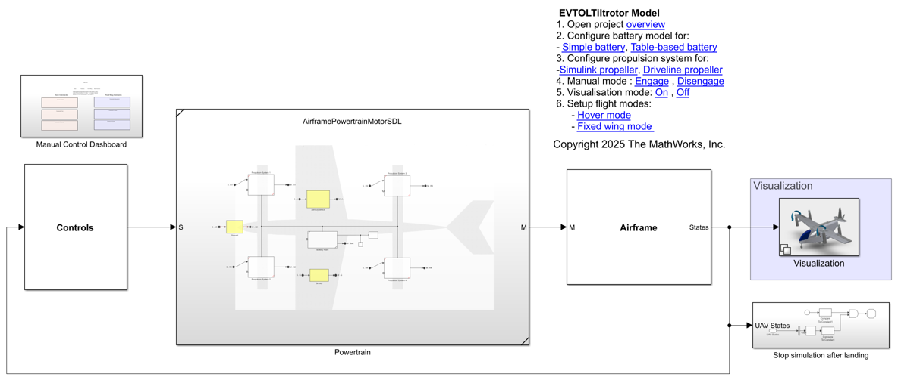
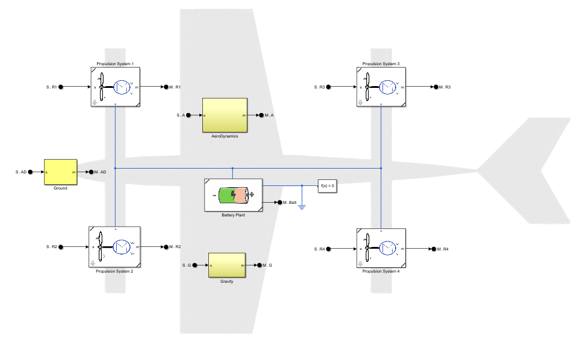
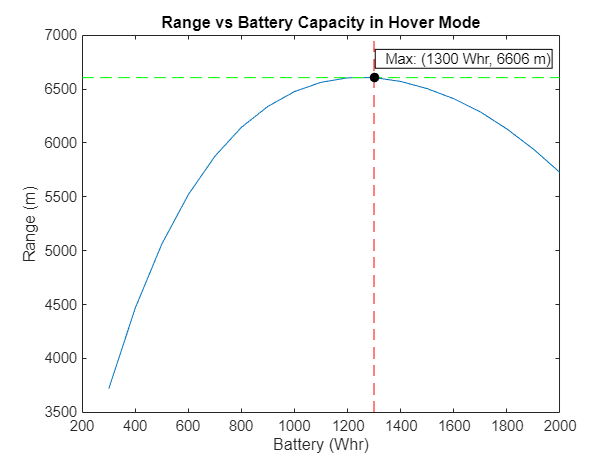
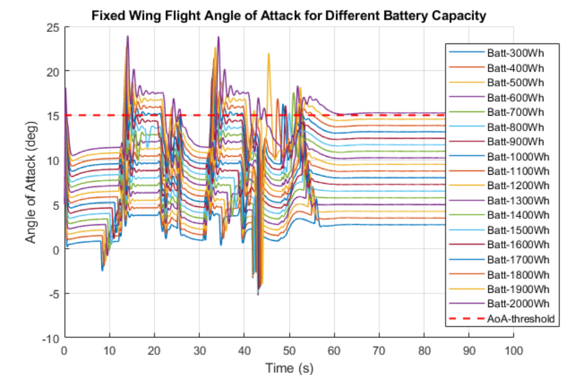
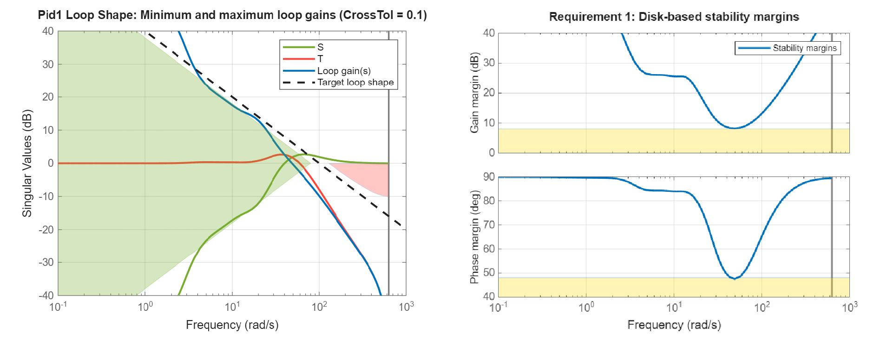

# eVTOL Drone Design with Simscape

Electric Vertical Take-Off and Landing (eVTOL) aircraft represent a significant advancement 
in aviation technology, combining the benefits of electric propulsion with the versatile 
capabilities of VTOL operations. These aircraft are designed to take off and land vertically, 
similar to helicopters, while also achieving efficient forward flight like traditional fixed-wing 
aircraft. 
eVTOL aircraft are being explored for diverse applications, including passenger transport, cargo delivery and
 medical evacuation. The ability to transition between hover and forward flight modes
 allows these aircraft to perform tasks that require both agility and speed.

  

The examples in this repository show you how to model powertrain of 
Electric Vertical Take-Off and Landing Drone for range estimation, battery sizing and control tuning. There are 
different fidelity of powertrain components, equivalent battery, table-based battery, battery pack and different 
fidelty of propulsion unit. The VTOL model is a coupled electrical, mechanical, model, UAV path planning and 6DoF euler 
block built using Simscape&trade; Battery&trade;, Simscape Electrical&trade;, Simscape Fluids&trade;, UAV Toolbox&trade;, 
Aerospace Toolbox&trade; Libraries

### **Powertrain of The Aircraft** ###
 
<table>
  <tr>
    <td class="image-column" width=1000></td>
  </tr>
</table>
 

### **Visualization of Simulation** ###

To visualise the simulation select "Visualization Mode: On" from model canvas.
<table>
  <tr>
    <td class="image-column" width=1000></td>
  </tr>
</table>
 

## **Battery Component Sizing and Range Estimation for Different Flight Modes.** ##

<table>
  <tr>
    <td class="image-column" width=400></td>
    <td class="text-column" width=25></td>
    <td class="image-column" width=450></td>
  </tr>
</table>
 

## **Control Tuning for Motor, Hover Mode and Fixed Wing Mode.** ##

<table>
  <tr>
    <td class="image-column" width=1000></td>
  </tr>
</table>
 

## Setup 
* Clone the project repository.
* Open eVTOLDroneSimscape.prj to get started with the project. 
* Requires MATLAB&reg; release R2024b or newer.

For a detailed example on VTOL design and control tuning, see example
[Customize VTOL UAV Configuration](https://www.mathworks.com/help/uav/ug/customize-vtol-configuration.html)

To learn more about modeling and simulation with Simscape, please visit:
* [Simscape Getting Started Resources](https://www.mathworks.com/solutions/physical-modeling/resources.html)
* Product Capabilities:
   * [Simscape](https://www.mathworks.com/products/simscape.html)
   * [Simscape Driveline](https://www.mathworks.com/products/simscape-driveline.html)
   * [Simscape Electrical](https://www.mathworks.com/products/simscape-electrical.html)
   * [Simscape Fluids](https://www.mathworks.com/products/simscape-fluids.html)
   * [Simscape Multibody](https://www.mathworks.com/products/simscape-multibody.html)

Copyright &copy; 2025 The MathWorks, Inc.
